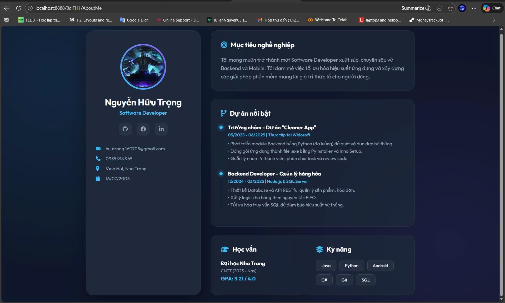
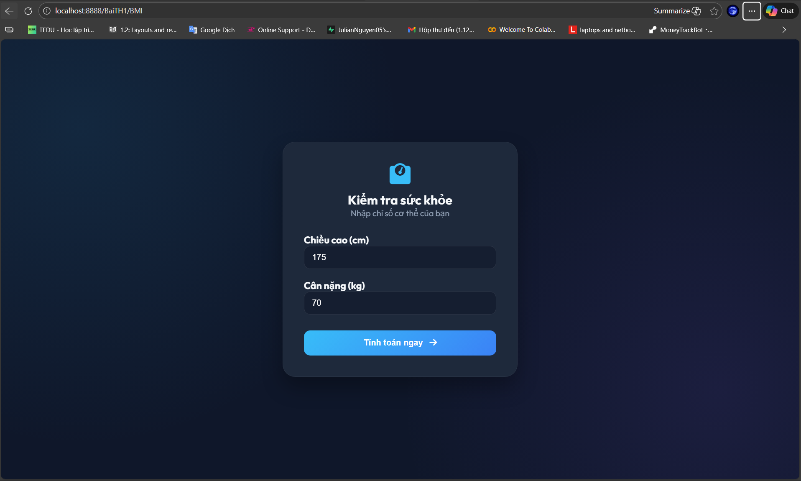
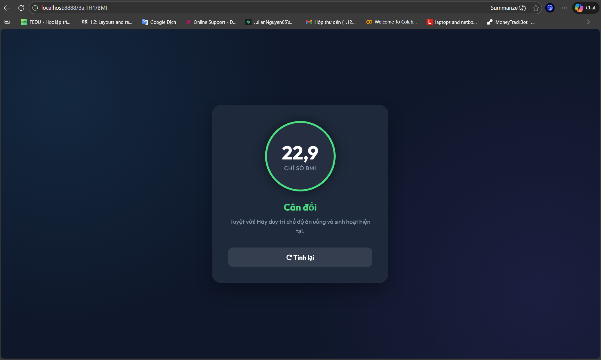
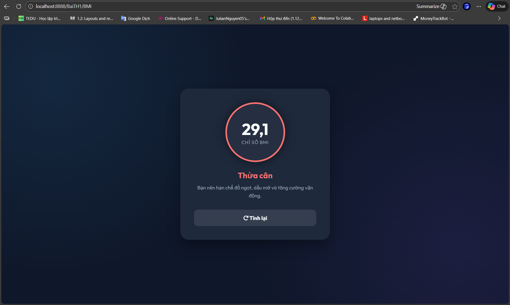

# Bài Thực Hành 1 - Lập trình Web 2 (Java Servlet)

**Sinh viên:** Nguyễn Hữu Trọng (Julian Nguyễn)  
**Lớp:** 65.CNTT-CLC  
**Mã sinh viên:** 65133958
**Công nghệ:** Java 11 (JDK 11), Tomcat 10.1 (Jakarta EE), Eclipse IDE.

---

## 📝 Giới thiệu
Dự án này là bài thực hành đầu tiên làm quen với **Java Servlet** trên nền tảng **Jakarta EE**. Mục tiêu là hiểu rõ cơ chế hoạt động của HTTP Methods (`GET`, `POST`) và cách xây dựng ứng dụng Web dynamic cơ bản.

Dự án bao gồm 4 bài tập nhỏ, đi từ việc xử lý logic thô sơ đến việc xây dựng giao diện hiện đại (Modern UI) tách biệt.

---

## 🚀 Điểm nhấn kỹ thuật: Logic & Giao diện

* **Bài 1.1 & 1.2 (Cách tiếp cận cổ điển):**
    * Sử dụng `PrintWriter` để in trực tiếp mã HTML trong file Java (`out.println("<html>...")`).
    * **Nhược điểm:** Code Java bị trộn lẫn với HTML, khó bảo trì, khó style CSS, không thực tế cho dự án lớn.
    
* **Bài 1.3 & 1.4 (Cách tiếp cận hiện đại - MVC cơ bản):**
    * **Tách biệt (Separation of Concerns):** HTML và CSS được viết ra các file riêng biệt (`.html`, `.css`, `.jsp`) nằm trong thư mục `webapp`.
    * **Servlet đóng vai trò Controller:** Chỉ xử lý logic và điều hướng dữ liệu bằng `RequestDispatcher`.
    * **Giao diện nâng cao:** Áp dụng phong cách **Glassmorphism** (Hiệu ứng kính), **Dark Mode**, và **Responsive Design** thay vì giao diện mặc định của trình duyệt.

---

## 📂 Danh sách bài tập

### 🔹 Bài 1.1 & 1.2: Xử lý `doGet` và `doPost` cơ bản
Minh họa cơ chế nhận request và phản hồi response cơ bản nhất của Servlet.
* **URL:** `/testDoGet`, `/testDoPost`
* **Chức năng:** Nhận dữ liệu text và hiển thị lại lên màn hình.

---

### 🔹 Bài 1.3: Giới thiệu bản thân (About Me)
Xây dựng trang Profile cá nhân với giao diện hiện đại, lấy cảm hứng từ CV thực tế.

* **URL:** `/AboutMe`
* **Kỹ thuật:**
    * Sử dụng file HTML/CSS tĩnh tách rời.
    * Style: **Dark Mode Tech Portfolio**.
    * Hiệu ứng: Animations (Fade-in), Hover effects.

**📸 Demo Giao diện:**
![Demo About Me]

---

### 🔹 Bài 1.4: Tính chỉ số BMI (Body Mass Index)
Ứng dụng tính toán sức khỏe, kết hợp Logic Java và Giao diện người dùng.

* **URL:** `/BMI`
* **Luồng xử lý:**
    1.  User truy cập `/BMI` (GET) → Servlet trả về form nhập liệu đẹp mắt (`bmi.html`).
    2.  User nhập liệu & Submit → Servlet xử lý tính toán (`doPost`).
    3.  Servlet trả kết quả về `bmi-result.jsp` với màu sắc tương ứng mức độ sức khỏe (Xanh/Vàng/Đỏ).
* **Kỹ thuật:** `RequestDispatcher`, chia sẻ CSS giữa HTML và JSP.

**📸 Demo Giao diện:**
![Demo BMI Calculator]

---

## 🛠️ Cài đặt & Chạy dự án

1.  **Yêu cầu hệ thống:**
    * JDK 11 trở lên.
    * Apache Tomcat 10.1
    * Eclipse Enterprise Java.

2.  **Các bước chạy:**
    * Clone dự án hoặc Import vào Eclipse.
    * Chuột phải vào Project chọn **Run As > Run on Server**.
    * Chọn Tomcat 10.1 Server.
    * Truy cập các đường dẫn tương ứng ở trên.

---
*© 2026 Julian Nguyen. Built with ❤️ and Java.*