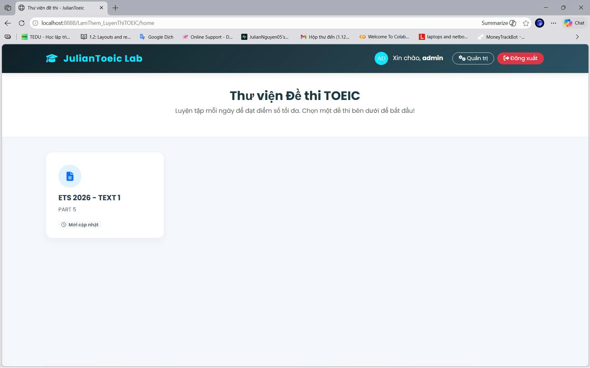
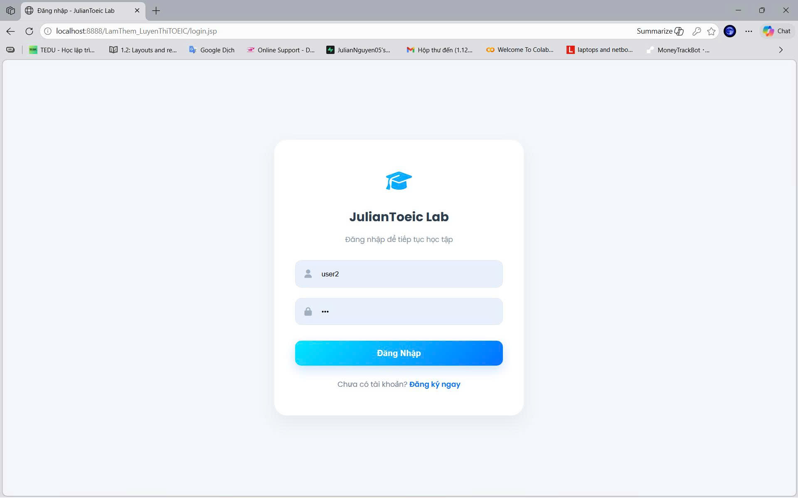
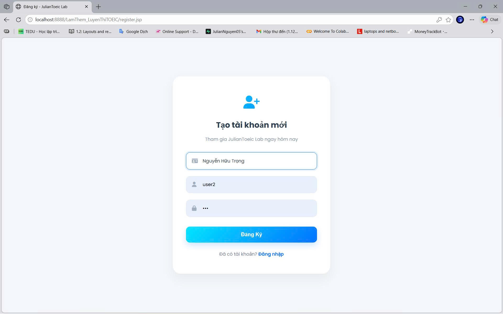
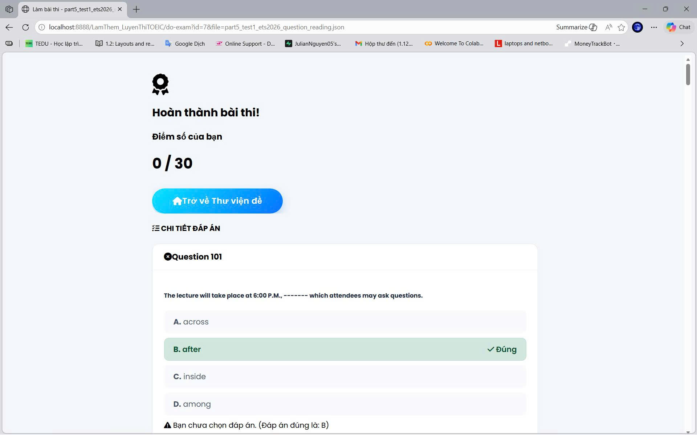
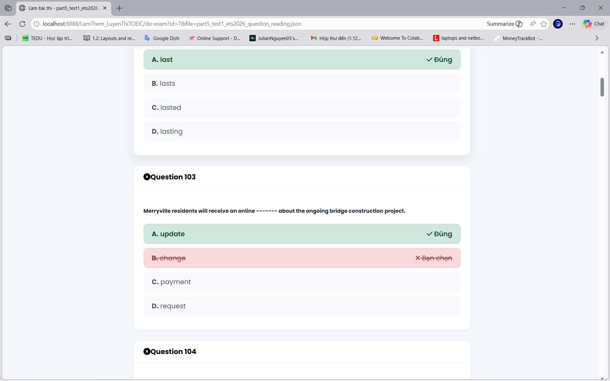
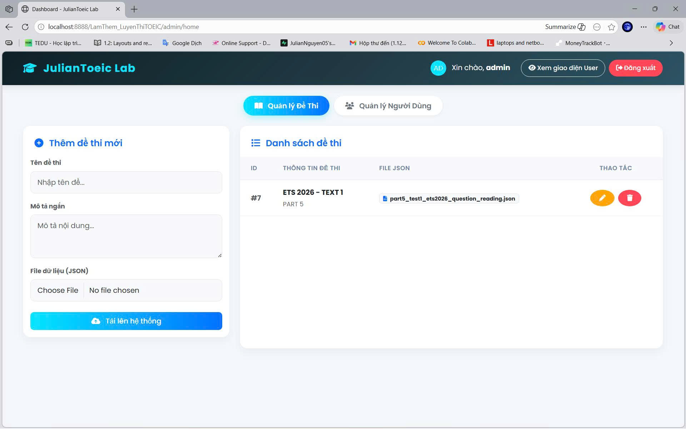
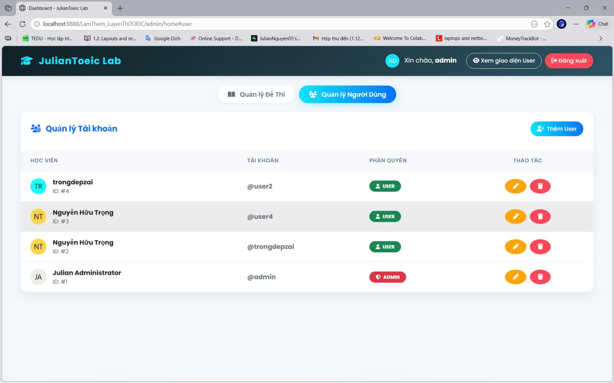

# JulianToeic Lab – TOEIC Part 5 Preparation System

An interactive and modern web application designed to help learners effectively prepare for the TOEIC exam. Built with Java Servlets, JSP, and a fully responsive user interface, JulianToeic Lab delivers a complete ecosystem—from user management and realistic exam simulation to competitive performance leaderboards.

This project was developed as a practical exercise to reinforce knowledge of MVC architecture, session management, and database interaction in a real-world web environment.

---

  

---

## 🌟 Project Overview

JulianToeic Lab provides a smooth and professional learning experience with a clear separation between two roles: **Admin** and **User**.

* The **Admin** has full control over the exam repository and user accounts through an intuitive dashboard.
* The **User** can access the exam library, experience a realistic Computer-Based Testing (CBT) interface, and track progress through an automated scoring system and leaderboard rankings.

### 🧩 Technical Stack

* **Backend:** Java Servlets, JSP (Jakarta EE 10)
* **Frontend:** HTML5, CSS3, Vanilla JavaScript, Bootstrap 5, FontAwesome
* **Database:** MySQL (via JDBC)
* **Architecture:** MVC (Model–View–Controller)

---

## 🚀 Key Features

### 1️⃣ Authentication & Authorization System

A secure authentication flow with a bright, modern glassmorphism-inspired interface.

* **Register:** Real-time duplicate username validation.
* **Login:** Secure credential verification with session tracking.
* **Role-Based Access:** Automatic redirect based on `USER` / `ADMIN`.

  

*Modern login interface with a striking gradient effect.*

  

*Clean and user-friendly registration interface.*

---

### 2️⃣ User Dashboard – Exam Library

* Interactive exam cards with hover effects.
* Modal popup for starting exams or viewing leaderboard.
* Dynamic avatar generation via external API.

  

*Personalized exam library with flexible options.*

---

### 3️⃣ Realistic CBT Exam Experience

* Split-screen layout for Parts 6 & 7.
* Full-width layout for Part 5.
* Auto-next question (0.4s delay).
* Real-time 20-minute countdown timer.
* Auto-submit when time expires.

  

*Focused exam workspace with intelligent column layout.*

---

### 4️⃣ Instant Auto-Scoring & Performance Review

* Instant score calculation.
* Two-column centered result layout.
* Color-coded answer feedback:

  * Correct → Dark green (`#d1e7dd`)
  * Incorrect → Red (`#f8d7da`)
* Silent background submission using Fetch API.

  

  

*Detailed score report with intuitive color-coded analysis.*

---

### 5️⃣ Leaderboard System

* Top 50 rankings per exam.
* Weighted ranking:

  * Higher score ranks first.
  * If tied → shorter time ranks higher.
* Medal highlights for Top 3 (🥇🥈🥉).

  

*Leaderboard honoring the highest achievers.*

---

### 6️⃣ Admin Dashboard

Organized with Nav-Tabs for clean management.

#### 📌 Exam Management

* Upload exams (JSON format)
* Edit or delete exams
* View metadata

  

*Exam repository control.*

#### 👤 User Management

* Create new users
* Update roles (`ADMIN` / `USER`)
* Remove accounts

  

*User account and role management.*

---

## 📚 Learning Outcomes

* Java Servlet lifecycle mastery
* JSP & JSTL dynamic rendering
* Secure session management with `HttpSession`
* Responsive UI with CSS Box Model
* Asynchronous communication via Fetch API

---

## 👨‍💻 Author

**JulianNguyen – Trongdepzai**

A passionate developer aspiring to become a full-stack engineer, focused on building practical, user-centered educational technology solutions while continuously expanding expertise across both frontend and backend development.

---