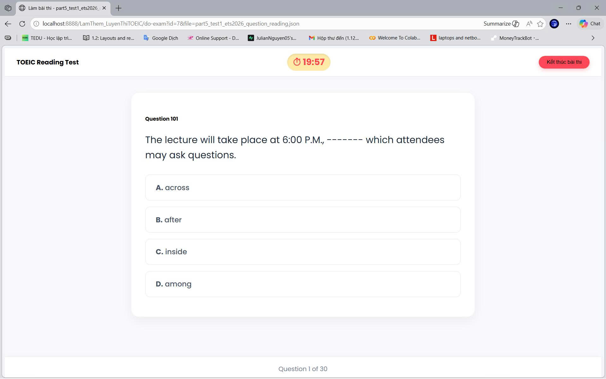
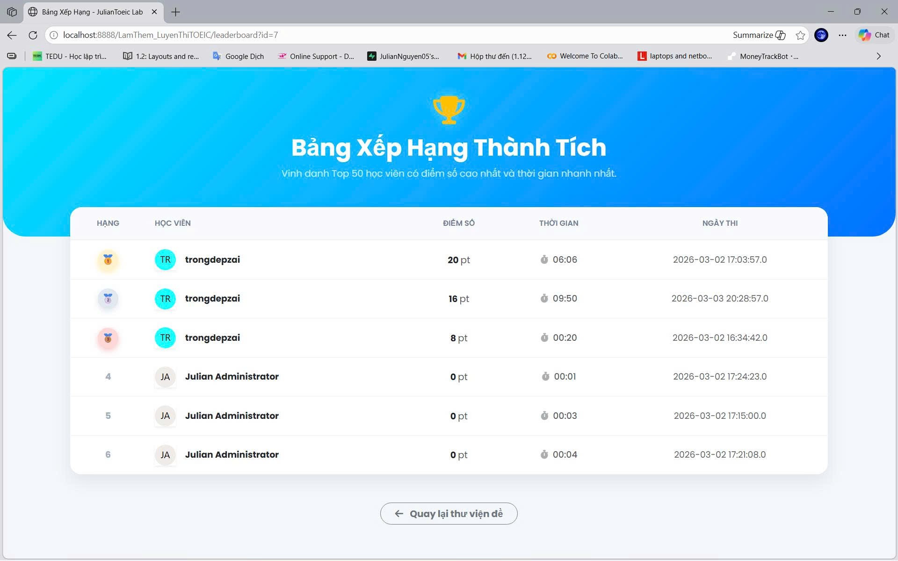

# 📚 Java Web Practice Repository

A collection of Java Web development exercises and mini-projects built during my learning journey.
This repository demonstrates practical implementation of **Servlet, JSP, MVC architecture, session management, and database interaction**.

---

## 📂 Repository Structure

### 🚀 📁 LamThem_LuyenThiTOEIC

A complete TOEIC Part 5 preparation system built with Java Servlets and JSP.

👉 **Project Details & Full Documentation:**
🔗 [View JulianToeic Lab README](./LamThem/LamThem_LuyenThiTOEIC/README.md)

  

  

This is the most comprehensive project in this repository, featuring:

* Role-based authentication (Admin/User)
* Realistic CBT exam interface
* Auto scoring & performance review
* Leaderboard ranking system
* Admin dashboard for exam & user management
* MVC architecture with MySQL integration

---

## 🛠️ Tech Stack Used Across Projects

* Java Servlets (Jakarta EE)
* JSP & JSTL
* MySQL (JDBC)
* HTML5, CSS3
* Bootstrap 5
* JavaScript (Fetch API)
* MVC Architecture

---

## 🎯 Learning Goals

This repository was created to:

* Strengthen understanding of Java Web application flow
* Practice real-world MVC implementation
* Improve frontend–backend integration skills
* Prepare for full-stack development progression

---

## 👨‍💻 Author

**JulianNguyen – Trongdepzai**
Aspiring Full-Stack Developer
Focused on building practical, user-centered educational technology solutions.

---